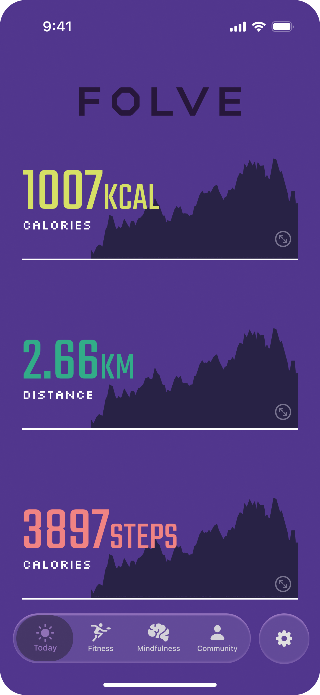
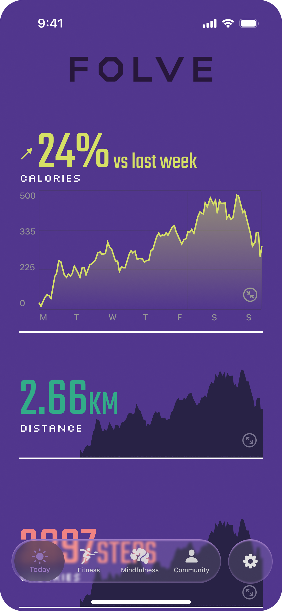
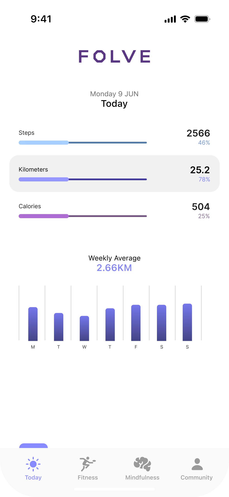
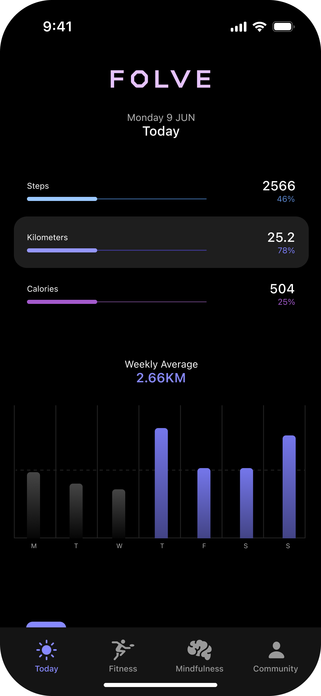
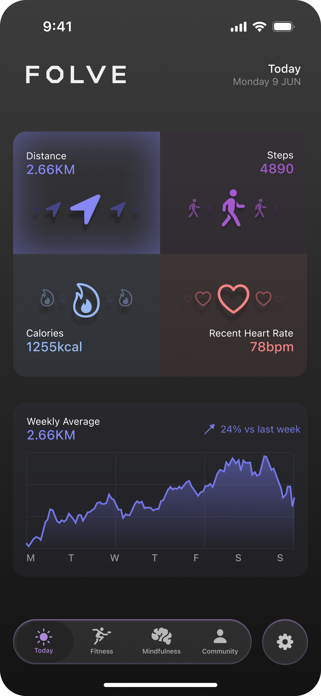
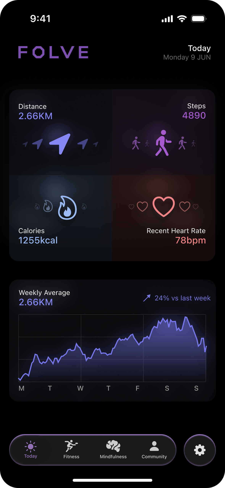

# Folve

Concept Design for fitness tracker IOS app.

## Overview

These are concept designs in 3 styles for a piece of wearable smart jewellery, that was meant to be accompanied by an iOS app. This project showcases innovative designs that blend fitness tracking functionality with elegant jewelry aesthetics.

## Design Styles

### Hippie Style

 

### Simple Style

 

### Sophisticated Style

 

## Design Notes

No AI was used in the design of these concepts. Most of these assets are custom made, with all lighting effects created from scratch. This project was developed following Apple's liquid glass announcement. Since no designer kit was released at that time, the glass effect navigation bar was custom made to replicate Apple's marketing campaign aesthetic.
